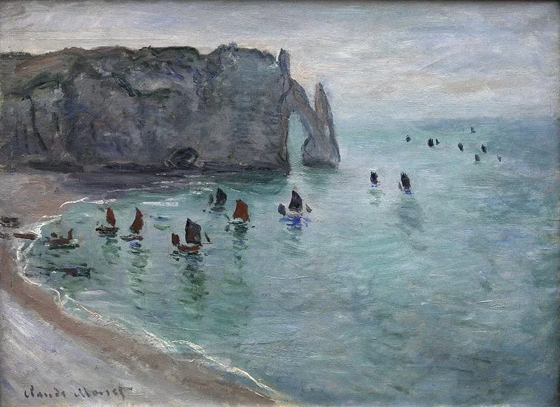

**介绍-象鼻山**

> 欧洲西大陆的断崖边，拥有绵延120公里的迷人海岸线

> 莫奈-象鼻山

> 追随春天的脚步，不负时光

**行程安排**

活动领队：<a href="https://www.uparisclub.com/" target="_blank">巴黎户外</a>

活动人数：48人

活动时间：2019年4月21日 周日

\- 7:40 Porte Maillot 集合

\- 12:00抵达 <a href="#Yport">Yport</a> 并开始徒步

\- 从Yport 途径 Bénouville，最终抵达Etretat

\- 中午择时<a href="#lunch">择地</a>进行野餐, 休息

\- 16:30 在Etretat上车返回巴黎，到达巴黎时间为 20:00

活动费用：38欧

---

<a id="Yport">

> 从Yport出发，远处山上有羊群

<a id="lunch"/>

> 午餐在Bénouville山顶

